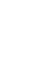
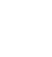
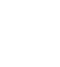

# Toki Pona Lesson 3:
## Simple sentences 
---
## Nouns:

|                  Glyph                   |  Word  |                      Meaning                       |
| :--------------------------------------: | :----: | :------------------------------------------------: |
|  | soweli | land animal, like a cat, dog, cow, mouse, elephant |
|    |  waso  |          bird, like a pigeon, goose, owl           |
|    |  pipi  |   insect, like a beetle, ant, butterfly, spider    |
|    |  kasi  |   plant, like a clover, birch tree, cactus, moss   |

---
## Verbs:
|                  Glyph                  | Word  |  Meaning   |
| :-------------------------------------: | :---: | :--------: |
|   | moku  | to consume |
|  | lukin |   to see   |
|   | sona  |  to know   |

---
## Sentence structure

- Same word order as English: noun, verb, object.
- Absolutely no conjugations.
- Particle **li** (󱤧) comes before the verb.
<!-- element style="font-family:nasin nanpa;" -->
- Particle **e** (󱤉) comes before the object.
<!-- element style="font-family:nasin nanpa;" -->

---
## Example sentences
| sitelen pona                                                    | sitelen Lasina          | Translation                |
| --------------------------------------------------------------- | ----------------------- | -------------------------- |
| 󱥢󱤧󱤶󱤉󱤗 <!-- element style="font-family:nasin nanpa;" --> | soweli li moku e kasi.  | The animal eats plants.    |
| 󱥴󱤧󱤶󱤉󱥑 <!-- element style="font-family:nasin nanpa;" --> | waso li moku e pipi.    | The bird eats bugs.        |
| 󱥑󱤧󱤮󱤉󱥢 <!-- element style="font-family:nasin nanpa;" --> | pipi li lukin e soweli. | The insect sees an animal. |
| 󱥴󱤧󱥡󱤉󱤗 <!-- element style="font-family:nasin nanpa;" --> | waso li sona e kasi.    | The bird knows the tree.   |

---
## Exercises
[https://wasona.com/en/03/](https://wasona.com/en/03/)